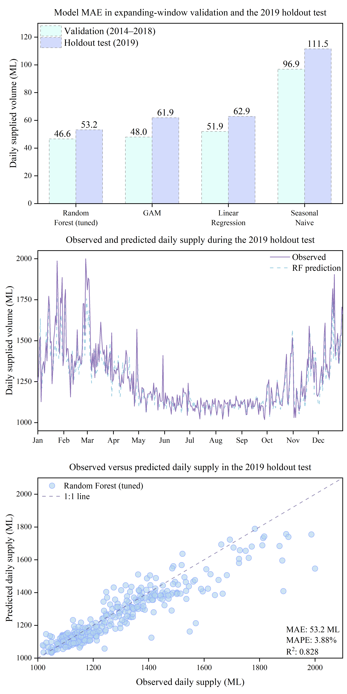

# Melbourne Daily Water Supply Forecasting

## Project overview

This project benchmarks retrospective daily predictions of Melbourne Water's
wholesale supplied volume using calendar variables, recent observed supply and
same-day ERA5 weather reanalysis. It is a compact research and portfolio
demonstration, not an operational forecasting system.

## Research question

How well can calendar variables, recent observed supply and same-day reanalysis
weather predict Melbourne's daily wholesale supplied volume?

## Data

The response variable is `supplied_ML`, the daily volume supplied from ten
Melbourne Water storages over a 24-hour period. It represents wholesale supply
to metropolitan retailers and regional water authorities, not household-level
demand. The source is the Victorian Government open-data resource
[Water Supply - Daily Volume Drawn from storage dams operated by Melbourne Water](https://discover.data.vic.gov.au/dataset/water-supply-daily-volume-drawn-from-storage-dams-operated-by-melbourne-water/resource/2f386033-f8c3-4e47-b206-29d433cc7e24).

Weather inputs are hourly
[ERA5 single-level reanalysis](https://cds.climate.copernicus.eu/datasets/reanalysis-era5-single-levels),
using 2 m temperature and total precipitation over a 3 x 3 grid around
Melbourne. Hourly UTC data are converted to
Melbourne local time and aggregated to daily mean, maximum and minimum
temperature and daily precipitation total.

Victorian public holidays for 2010-2019 are generated with the `holidays`
package. See [data/README.md](data/README.md) for file placement, fields and
licensing details.

## Forecasting interpretation

Supply-derived predictors use only observations from prior days. The current
day's target is never used as its own predictor. In contrast, the weather
features use the complete same-day ERA5 reanalysis record, including all
temperature and precipitation observations for the target day.

The experiment is therefore a retrospective forecasting benchmark in which
same-day ERA5 weather is treated as known. It provides an optimistic benchmark
under this information setting rather than a deployable strict day-ahead
forecast. A real day-ahead system would need weather forecasts that
are available at prediction time.

## Workflow

```text
raw supply + hourly ERA5
    -> daily weather and model features
    -> 2014-2018 expanding-window validation
    -> Random Forest parameter search
    -> independent 2019 holdout evaluation
```

The retained period is 2010-11-01 to 2019-12-31:

- 2010-11-01 to 2010-12-31: warm-up for lagged features;
- 2011-01-01 to 2018-12-31: development period;
- 2014-2018: expanding-window validation years;
- 2019: independent holdout, excluded from model comparison and tuning.

## Features

The models use:

- daily mean temperature and daily temperature range;
- log-transformed daily precipitation and prior seven-day precipitation;
- day of week, public holiday and annual-cycle terms;
- one-day and seven-day supply lags;
- mean supply over the previous seven days.

All supply-based lag and rolling features are shifted before calculation, so
they contain no current-day supplied volume.

## Models and validation

The retained models are Seasonal Naive, Linear Regression, GAM, Random Forest
and Tuned Random Forest. No additional model families are introduced.

For each validation year, training uses all available development years before
that year. Random Forest tuning repeats the same 2014-2018 folds over the
original 27-configuration grid. The selected specification is:

```text
n_estimators = 300
max_depth = None
min_samples_leaf = 2
max_features = 0.8
random_state = 42
```

## Results

Pooled expanding-window validation MAE was 46.60 ML for the Tuned Random
Forest, 47.95 ML for GAM, 51.92 ML for Linear Regression and 96.87 ML for the
Seasonal Naive benchmark. The small difference between Tuned Random Forest and
GAM should not be overstated.

The preselected Tuned Random Forest achieved the following results on the
untouched 2019 holdout:

| Metric | Value |
|---|---:|
| MAE | 53.16 ML |
| RMSE | 81.65 ML |
| MAPE | 3.88% |
| R2 | 0.8285 |
| Negative predictions | 0 |



A single holdout year does not establish broad generalisation or causal
relationships.

## Repository structure

```text
.
|-- README.md
|-- requirements.txt
|-- data/
|   |-- README.md
|   |-- raw/
|   `-- processed/
|-- scripts/
|   |-- download_era5.py
|   |-- 01_prepare_data.py
|   |-- model_utils.py
|   |-- 02_validate_and_tune.py
|   `-- 03_evaluate_holdout.py
|-- results/
|   `-- figure_data/
`-- figures/
    `-- melbourne_water_demand_results.png
```

## Reproduction

Tested with Python 3.11.3. Run all commands from the repository root.

Windows PowerShell:

```powershell
python -m venv .venv
.\.venv\Scripts\Activate.ps1
python -m pip install -r requirements.txt
python scripts\01_prepare_data.py
python scripts\02_validate_and_tune.py
python scripts\03_evaluate_holdout.py
```

macOS or Linux:

```bash
python3 -m venv .venv
source .venv/bin/activate
python -m pip install -r requirements.txt
python scripts/01_prepare_data.py
python scripts/02_validate_and_tune.py
python scripts/03_evaluate_holdout.py
```

Place the raw files as described in `data/README.md` before running the three
analysis scripts. If ERA5 files are not already available, configure the CDS
API and run the optional downloader after activating the environment:

```bash
python scripts/download_era5.py
```

The second analysis script writes validation, stability and tuning tables. The
third writes 2019 predictions and metrics. Figure-source tables are written to
`results/figure_data/`.

## Limitations

The evaluation uses full same-day ERA5 reanalysis rather than weather
forecasts available before the target day. Operational deployment would also
require an automated supply-data feed, monitoring, failure handling and
periodic retraining. Holiday definitions depend on the installed calendar
package. The target is an aggregate wholesale volume and does not describe
household behaviour. Results are specific to the retained period, feature
definitions and one 2019 holdout year.
